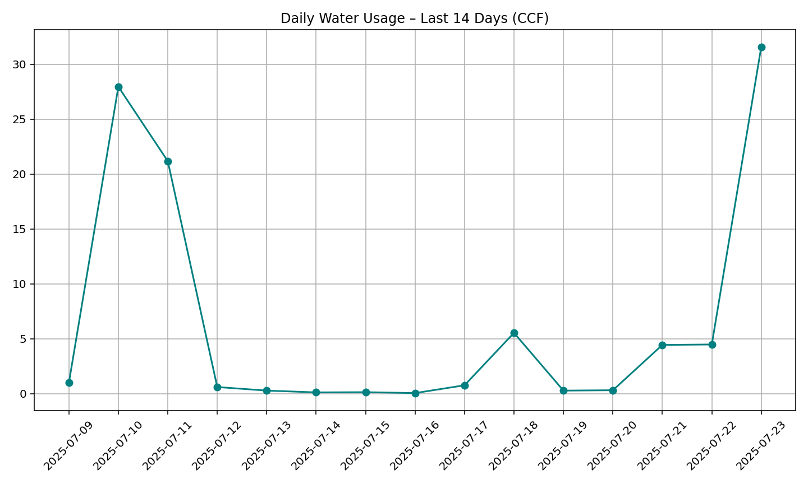
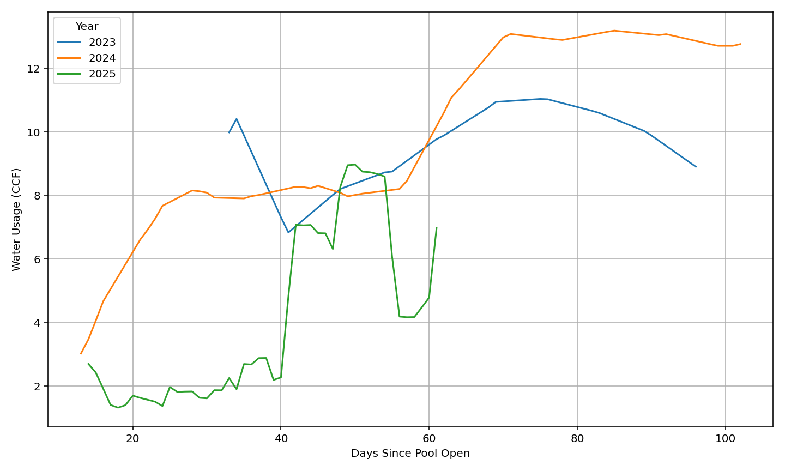

# 💧 Flume Water Dashboard

### 📈 Daily Usage – Last 14 Days

### 📊 Pool Season Comparison

### 📅 Last 30 Days of Use
| Date       | Usage (CCF) | Cost ($) |
|------------|-------------|----------|
| 2025-06-24 | 0.18       | 1.18 |
| 2025-06-25 | 7.89       | 52.85 |
| 2025-06-26 | 0.67       | 4.48 |
| 2025-06-27 | 11.54       | 77.31 |
| 2025-06-28 | 0.34       | 2.31 |
| 2025-06-29 | 3.38       | 22.68 |
| 2025-06-30 | 0.34       | 2.25 |
| 2025-07-01 | 0.90       | 6.05 |
| 2025-07-02 | 1.17       | 7.87 |
| 2025-07-03 | 36.03       | 241.42 |
| 2025-07-04 | 32.01       | 214.48 |
| 2025-07-05 | 0.54       | 3.60 |
| 2025-07-06 | 0.24       | 1.58 |
| 2025-07-07 | 0.22       | 1.47 |
| 2025-07-08 | 0.07       | 0.49 |
| 2025-07-09 | 0.99       | 6.66 |
| 2025-07-10 | 27.95       | 187.30 |
| 2025-07-11 | 21.17       | 141.84 |
| 2025-07-12 | 0.60       | 4.00 |
| 2025-07-13 | 0.27       | 1.83 |
| 2025-07-14 | 0.11       | 0.73 |
| 2025-07-15 | 0.13       | 0.86 |
| 2025-07-16 | 0.05       | 0.31 |
| 2025-07-17 | 0.76       | 5.07 |
| 2025-07-18 | 5.53       | 37.06 |
| 2025-07-19 | 0.27       | 1.82 |
| 2025-07-20 | 0.30       | 2.04 |
| 2025-07-21 | 4.43       | 29.71 |
| 2025-07-22 | 4.47       | 29.97 |
| 2025-07-23 | 31.59       | 211.67 |

### 💰 Season Usage Summary
- **Cost so far:** `$1,300.88`
- **Projected remaining cost:** `$1,734.51`
- Based on `6.47 CCF/day` × `40` days @ `$6.70/CCF`

_Dashboard auto-updated on 2025-07-23_
